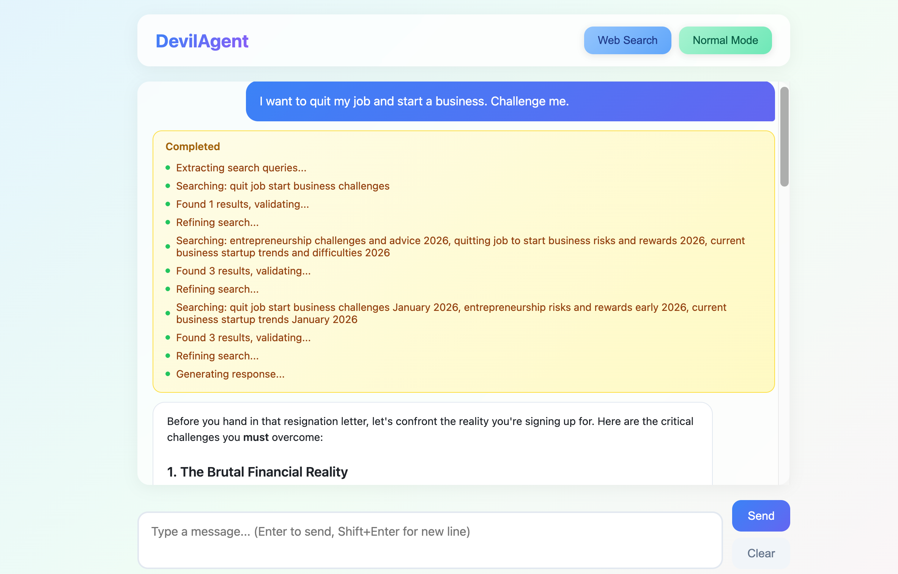

# DevilAgent 👿

A dual-mode AI assistant combining everyday Q&A with professional red-team analysis.

---

## ✨ Features

| Feature | Description |
|---------|-------------|
| **Dual Mode** | Switch between Normal (helpful) and Devil (critical reviewer) modes |
| **ReAct Search** | Extract → Search → Validate → Refine loop with concurrent queries |
| **Skills System** | Auto-loads specialized checklists based on content type |
| **Streaming** | Real-time typewriter output with progress indicators |
| **Citations** | All responses include source links when available |

---

## Homepage


## Slides

[slides](docs/intro.pdf)


## 🎯 Devil Mode Output

```
🔴 MUST FIX - Critical issues
🟡 SHOULD FIX - Medium priority
📝 SUGGESTIONS - Optimization tips
```

## web url

https://ricardo-goniac-droopily.ngrok-free.dev/

## Input

1. logic-auditor
I want to quit my job and start a business. Challenge me.

2. code-checker
Check my code:
```python
password = input()
if password == "admin123": login()
```
3. general-reviewer
I'm dropping out of college to become an influencer. Roast my plan.

4. logic-auditor
I want to put all my savings into crypto. Tell me why I'm wrong.

5. general-reviewer
My app idea: Uber for dogs. Poke holes in it.


---

## 🚀 Quick Start

```bash
# 1. Install dependencies
pip install -r requirements.txt

# 2. Configure environment
cp .env.example .env
# Edit .env with your API keys

# 3. Run server
python server.py

# 4. Open browser
# http://localhost:8321
```

---

## ⚙️ Environment Variables

```env
OPENAI_API_KEY=your_api_key
OPENAI_BASE_URL=https://api.openai.com/v1  # Optional
OPENAI_MODEL=gpt-4o-mini
```

---

## 📁 Project Structure

```
DevilAgent/
├── main.py          # Core agent logic
├── server.py        # FastAPI web server
└── skills/          # Review checklists
    ├── code-checker/
    │   └── SKILL.md
    └── logic-auditor/
        └── SKILL.md
```

---

## 🛠️ Tech Stack

- **Backend**: FastAPI + LangChain
- **Search**: DuckDuckGo (no API key needed)
- **Streaming**: Server-Sent Events (SSE)
- **Frontend**: Vanilla JS + CSS Glassmorphism

---

## 📖 Usage

| Control | Action |
|---------|--------|
| `Web` toggle | Enable/disable web search |
| `Normal/Devil` toggle | Switch review mode |
| `Clear` button | Reset conversation |

---

## 🔧 Adding Custom Skills

Create `skills/your-skill/SKILL.md`:

```yaml
---
name: your-skill
description: What this skill does
---

# Workflow
1. Step one
2. Step two
```

---

https://luma.com/oj8674lc?tk=QgM06X


## 📄 License

MIT